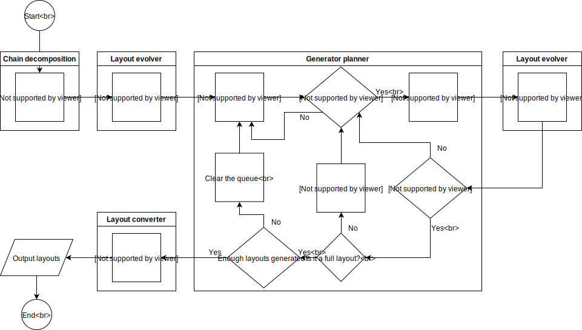

This whole section is about the `ChainBasedGenerator` class which is the class that connects all the building blocks that are needed to generate layouts.

The generator was implemented with _extensibility_ in mind and pretty much any part of the algorithm can be replaced with a custom implementation. Pages in this section explain all the building blocks of the algorithm and show how to extend the algorithm.

## High-level structure
The generator is made of following building blocks:
- [Configuration spaces](configurationSpaces.md) - knows which polygon positions are valid
- [Layout evolver](layoutEvolvers.md) - evolution of valid partial layouts
- Chain decomposition - decomposing input graphs into chains
- Layout operations - layout perturbations and energy handling
- [Generator planner](configurationSpaces.md) - directing which layouts are further evolved
- Layout converter - converting layouts from their internal representation to something more useful

The basic idea is that the input graph is decomposed into chains (e.g. sets of vertices). Layouts are then created incrementally by adding chains one by one. After adding a chain, the algorithm starts with a possibly not valid partial layout and uses a layout evolver (currently simulated annealing) to evolve a valid layout. Another chain is then added until a full layout is generated. See the following diagram:

**Note:** It would seem that a generator planner is the most complicated part of the layout generator. Well, it's like the exact opposite - there is like nothing more to it that is not already shown. It's just important for imagining how the whole algorithm works but most of the _magic_ happens in _layout evolvers_.

**Note:** _Layout operations_ and _configuration spaces_ are not shown in the diagram but they are extensively used in layout evolvers.

## Used terms

### Node

### Configuration
_Configuration_ is a term used when referring to the state of a given node in the layout. It contains information mainly about the position and the shape of the node. It also holds information about the energy of the node and anything that is useful in the process.