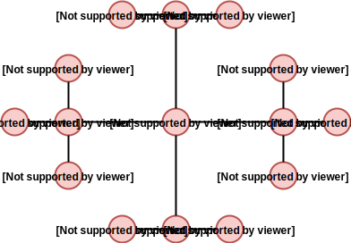

In this tutorial, we will describe how to control the appearence of generated layouts by setting probabilities of choosing individual room shapes.

## Setup

In this tutorial, we will use a graph with 15 vertices codenamed *Example5*:



## Room shapes
We will define 2 square and 2 rectangle room shapes for this tutorial.

**Note:** We need at least 3 room shapes for this tutorial to work. This is because when we perturb the shape of a node, we must always pick a different shape.

### Using C# api

```csharp
var doorMode = new OverlapMode(1, 1);

var squareRoomBig = new RoomDescription(
  GridPolygon.GetSquare(8),
  doorMode
);
var squareRoomSmall = new RoomDescription(
  GridPolygon.GetSquare(6),
  doorMode
);
var rectangleRoomBig = new RoomDescription(
  GridPolygon.GetRectangle(8, 12),
  doorMode
);
var rectangleRoomSmall = new RoomDescription(
  GridPolygon.GetRectangle(6, 10),
  doorMode
);
```

### Using config files

```yaml
# Resources/Rooms/tutorial_differentProbabilities.yaml

name: tutorial_differentProbabilities
default:
  doorMode: !OverlapMode
    doorLength: 1
    cornerDistance: 1
roomDescriptions:
  square-big:
    shape: [[0,0], [0,8], [8,8], [8,0]]
  square-small:
    shape: [[0,0], [0,6], [6,6], [6,0]]
  rectangle-big:
    shape: [[0,0], [0,8], [12,8], [12,0]]
  rectangle-small:
    shape: [[0,0], [0,6], [10,6], [10,0]]
```

## Adding probabilities
We will now make the bigger square have ten times greater probability to be picked.

**Note:** It is not guaranteed that generated layouts will obey a defined probability distribution. This is because some shapes are not suitable for the input graph and simulated annealing will have problems when trying to lay them out. And that will result in mostly accepting layouts without such shapes even if we set high probabilities to them.

### Using C# api

```csharp
var mapDescription = new MapDescription<int>();

// Graph and shapes are created here.

mapDescription.AddRoomShapes(squareRoomBig, probability: 10);
mapDescription.AddRoomShapes(squareRoomSmall);
mapDescription.AddRoomShapes(rectangleRoomBig);
mapDescription.AddRoomShapes(rectangleRoomSmall);
```

### Using config files
In previous tutorials, we always utilized the fact that we had all our room shapes in one file and we could therefore simply add all of them at once. In this tutorial, however, we want to specify the probability of one of the rooms shapes. That means that we have to add room shapes one by one instead of adding them all at once.

```yaml
# Resources/Maps/tutorial_differentProbabilities.yml

# Rooms and passages are added here.

defaultRoomShapes:
  -
    setName: tutorial_differentProbabilities
    roomDescriptionName: square-big
    probability: 10
  -
    setName: tutorial_differentProbabilities
    roomDescriptionName: square-small
  -
    setName: tutorial_differentProbabilities
    roomDescriptionName: rectangle-big
  -
    setName: tutorial_differentProbabilities
    roomDescriptionName: rectangle-small
```

## Summary
The map description is now ready to be used in a layout generator. You can find the full C# source code [here](https://github.com/OndrejNepozitek/ProceduralLevelGenerator/blob/master/Sandbox/Examples/DifferentProbabilitiesExample.cs) and the config files [here](https://github.com/OndrejNepozitek/ProceduralLevelGenerator/tree/master/Resources).

## Results

<div class="results">
  <a href="/ProceduralLevelGenerator/docs/assets/differentProbabilities/0.jpg" target="_blank">
    
  </a>
  <a href="/ProceduralLevelGenerator/docs/assets/differentProbabilities/1.jpg" target="_blank">
    
  </a>
  <a href="/ProceduralLevelGenerator/docs/assets/differentProbabilities/2.jpg" target="_blank">
    
  </a>
  <a href="/ProceduralLevelGenerator/docs/assets/differentProbabilities/3.jpg" target="_blank">
    
  </a>
</div>

**Note:** Click on images to see them in a full size.

